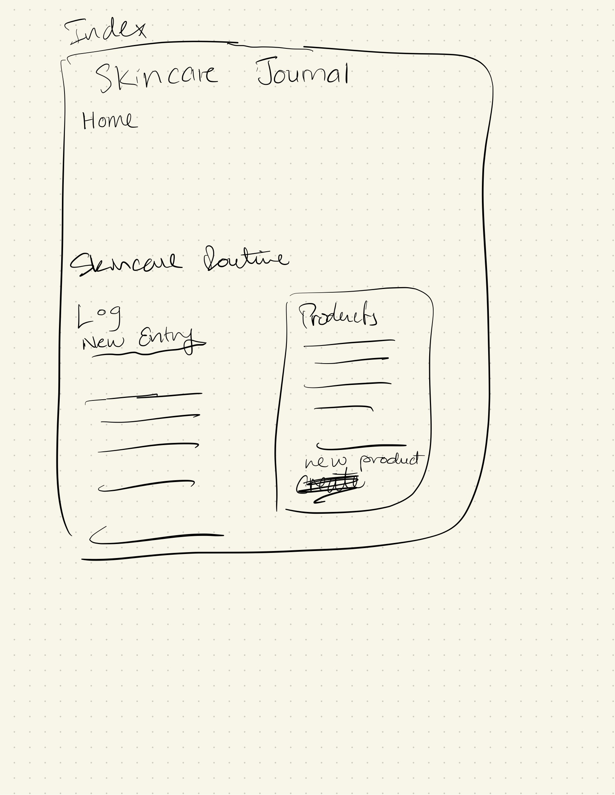
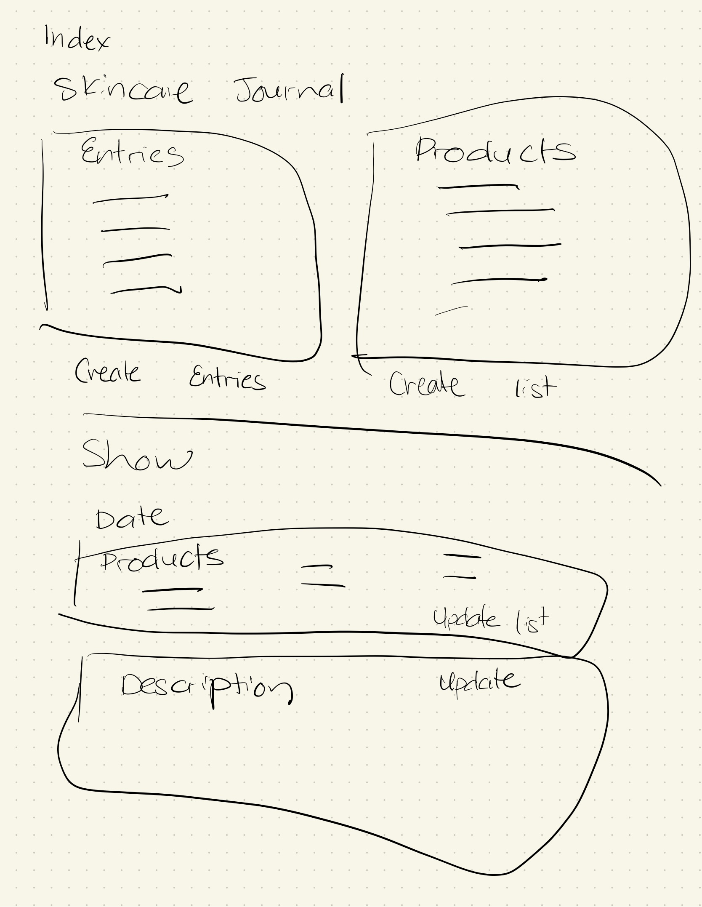
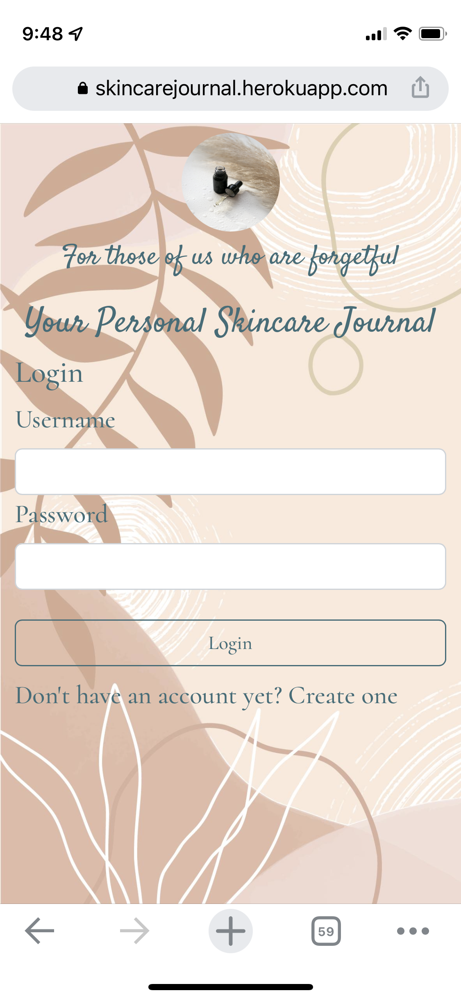

# Skincare Journal

### Week 6 - Second Project

A online Skincare Journal. Using applications:

1. Node.js
2. Express
3. MongoDB
4. Mongoose
5. HTML/EJS
6. CSS/Bootstrap

Uses MVC file structure.
7 Restful routes and full crud application for Mobile and Desktop.

Feel free to make an account and use the journal.

- Heroku: [Journal](https://skincarejournal.herokuapp.com/login).
- Github: [Journal](https://github.com/Suzyyc/skincare-journal).

## Brief

Link to the [brief](https://git.generalassemb.ly/seir59anz/seir59anz-course-materials/tree/main/express/project).

## Wireframes

 

## Journal Features

Individual Users can write a journal of their current skincare routine. They can include the products of what they are using and make notes of whats working for them.

- Add Journal Entries and include skincare prodcuts
- Add skincare products
- Edit skincare products
- Edit Journal Entries

## Mobile Friendly

## Future features

- AM & PM Skincare Routine to choose from
- User can upload pictures of their skincare product
